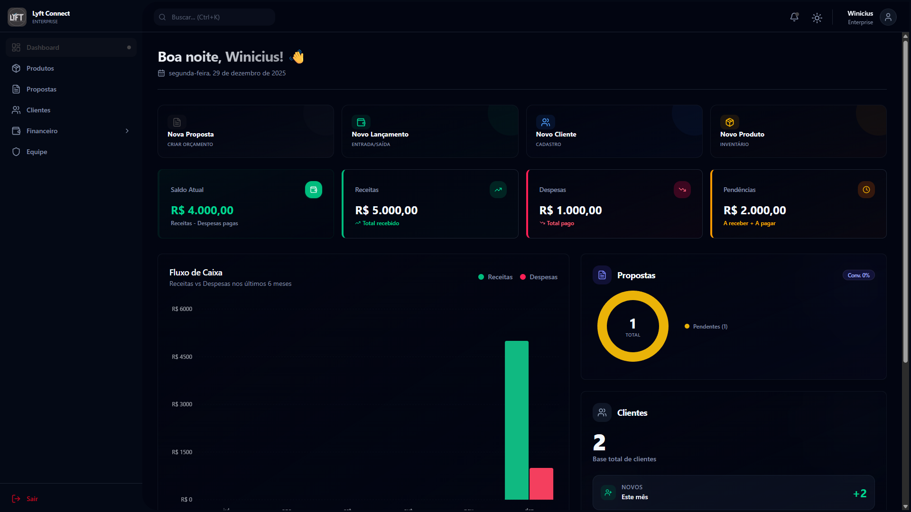
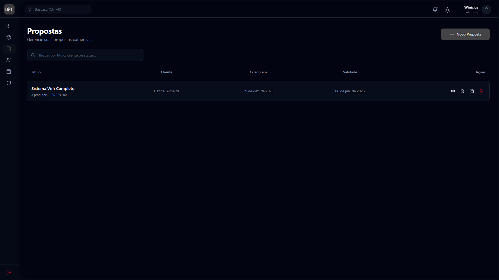

# 🚀 Template ERP

O sistema de gestão empresarial moderno e intuitivo para transformar a forma como você gerencia seu negócio.

---

## ✨ O que é o Template ERP?

Uma plataforma completa de gestão empresarial desenvolvida para simplificar suas operações diárias. Centralize propostas, clientes, produtos e finanças em um único lugar, aumentando sua produtividade e profissionalizando sua operação.

---

## 🎯 Arquitetura de Integração (WhatsApp e Stripe)

O Template ERP possui um backend unificado no **Firebase Functions (Cloud Run)** para garantir máxima segurança e centralização de credenciais, incluindo fluxos de Webhooks e Cron Jobs:

### WhatsApp Webhook

Para configurar o WhatsApp API no painel de desenvolvedores da Meta:

- **URL de Callback:** `https://[SUA_URL_DO_CLOUD_RUN]/webhooks/whatsapp`
- **Verify Token:** Configurável via variável de ambiente `WHATSAPP_VERIFY_TOKEN` (em `functions/.env`).

### Cron Jobs (WhatsApp Overage)

O faturamento do uso extra do WhatsApp (Overage) é executado autonomamente via **Firebase Scheduled Functions** (`reportWhatsappOverage`) todo dia 1º do mês (03:00 AM).

- Existe uma rota manual para debug: `POST https://[SUA_URL_DO_CLOUD_RUN]/internal/cron/whatsapp-overage-report` (protegida pelo Header `x-cron-secret` usando `CRON_SECRET`).

> **Importante:** Variáveis críticas como `STRIPE_SECRET_KEY` e `WHATSAPP_APP_SECRET` residem ESCLUSIVAMENTE no ambiente do Firebase (`functions/.env`). O frontend Next.js (Vercel) apenas consome as chaves públicas (`NEXT_PUBLIC_*`).

---

## Principais Funcionalidades

### 📄 Propostas Profissionais

Crie propostas impressionantes em poucos minutos. Personalize com sua marca, adicione produtos do catálogo e exporte para PDF pronto para enviar ao cliente.

### 👥 Gestão de Clientes

Centralize todos os dados dos seus clientes. Acompanhe o histórico de interações, negociações e mantenha um relacionamento organizado.

### 📦 Catálogo de Produtos

Organize seu catálogo com fotos, preços e descrições. Atualizações refletem automaticamente em todas as propostas.

### 📊 Dashboard Inteligente

Visualize métricas importantes em tempo real. Acompanhe vendas, metas e desempenho para tomar decisões baseadas em dados.

### 💰 Controle Financeiro

Gerencie receitas, despesas e carteiras financeiras. Tenha visão clara do fluxo de caixa da sua empresa.

### 👨‍👩‍👧‍👦 Gestão de Equipe

Adicione membros à sua equipe com diferentes níveis de permissão. Controle quem acessa o quê no sistema.

---

## 🔐 Segurança

- ✅ Criptografia SSL em todas as transações
- ✅ Split-Backend (Segredos críticos isolados do Frontend)
- ✅ Dados financeiros nunca armazenados em nossos servidores
- ✅ Backups automáticos diários
- ✅ Controle de acesso por níveis de permissão

---

**Simplifique sua gestão. Aumente sua produtividade.**

_Template ERP - O sistema de gestão que sua empresa precisa_

