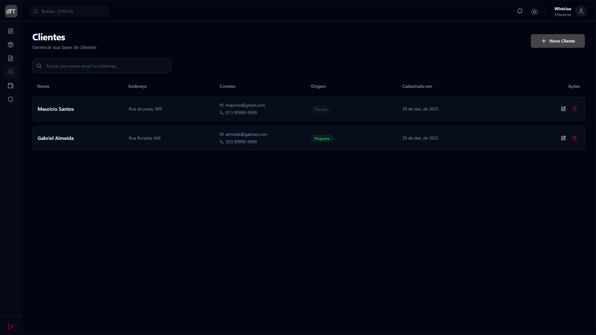
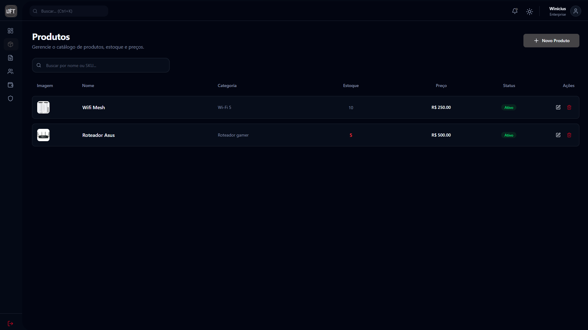
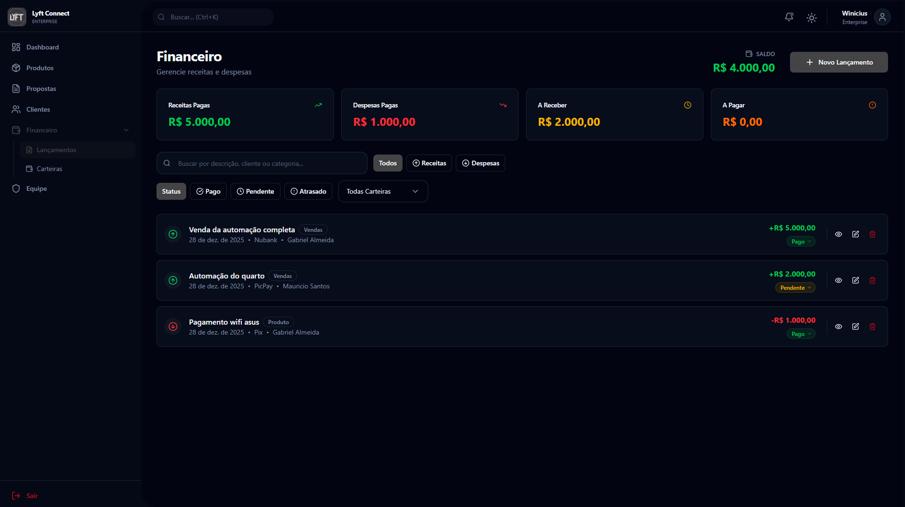
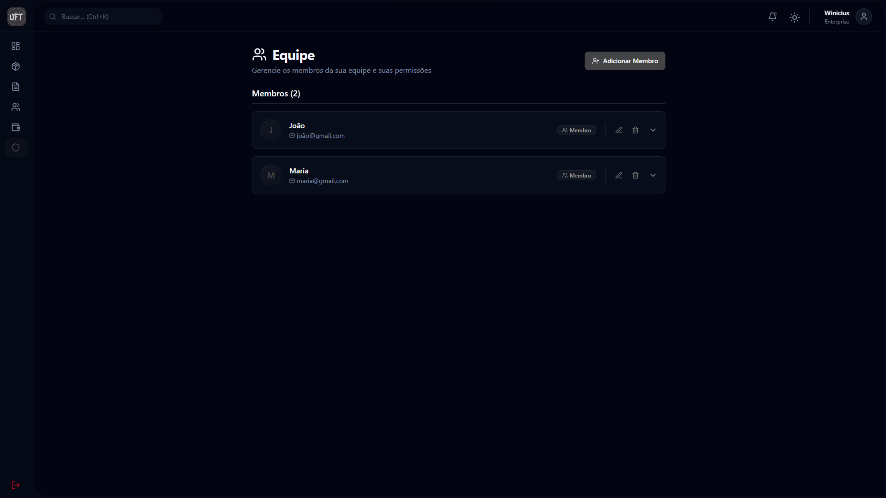

# 🚀 Template ERP

O sistema de gestão empresarial moderno e intuitivo para transformar a forma como você gerencia seu negócio.

---

## ✨ O que é o Template ERP?

Uma plataforma completa de gestão empresarial desenvolvida para simplificar suas operações diárias. Centralize propostas, clientes, produtos e finanças em um único lugar, aumentando sua produtividade e profissionalizando sua operação.

---

## 🎯 Principais Funcionalidades

### 📄 Propostas Profissionais

Crie propostas impressionantes em poucos minutos. Personalize com sua marca, adicione produtos do catálogo e exporte para PDF pronto para enviar ao cliente.

### 👥 Gestão de Clientes

Centralize todos os dados dos seus clientes. Acompanhe o histórico de interações, negociações e mantenha um relacionamento organizado.

### 📦 Catálogo de Produtos

Organize seu catálogo com fotos, preços e descrições. Atualizações refletem automaticamente em todas as propostas.

### 📊 Dashboard Inteligente

Visualize métricas importantes em tempo real. Acompanhe vendas, metas e desempenho para tomar decisões baseadas em dados.

### 💰 Controle Financeiro

Gerencie receitas, despesas e carteiras financeiras. Tenha visão clara do fluxo de caixa da sua empresa.

### 👨‍👩‍👧‍👦 Gestão de Equipe

Adicione membros à sua equipe com diferentes níveis de permissão. Controle quem acessa o quê no sistema.

---

## 🌟 Por que escolher o Template ERP?

| Benefício                 | Descrição                                                                      |
| ------------------------- | ------------------------------------------------------------------------------ |
| ⚡ **Rápido e Intuitivo** | Interface moderna que sua equipe aprende em minutos, sem treinamento extensivo |
| 🔒 **Seguro e Confiável** | Dados protegidos com criptografia de ponta e backups automáticos               |
| ☁️ **100% na Nuvem**      | Acesse de qualquer lugar, em qualquer dispositivo com internet                 |
| 📱 **Design Responsivo**  | Funciona perfeitamente em computadores, tablets e celulares                    |
| 🎨 **Personalizável**     | Adicione sua logo e personalize as propostas com a identidade da sua marca     |

---

## 📋 Como Funciona

1. **Cadastre sua empresa** - Crie sua conta em segundos e configure o perfil da sua empresa
2. **Adicione seus produtos** - Importe ou cadastre manualmente seu catálogo de produtos e serviços
3. **Crie propostas incríveis** - Monte propostas profissionais em poucos cliques
4. **Acompanhe resultados** - Visualize métricas de vendas e tome decisões baseadas em dados

---

## 💳 Planos Disponíveis

Oferecemos planos flexíveis que se adaptam ao tamanho e necessidade da sua empresa:

- **Starter** - Ideal para começar e testar a plataforma
- **Professional** - Para empresas em crescimento que precisam de mais recursos
- **Enterprise** - Solução completa para empresas maiores

> 💡 **Economia de até 20%** no plano anual!

---

## 🔐 Segurança

- ✅ Criptografia SSL em todas as transações
- ✅ Dados financeiros nunca armazenados em nossos servidores
- ✅ Backups automáticos diários
- ✅ Controle de acesso por níveis de permissão

---

## ❓ Perguntas Frequentes

**O pagamento é seguro?**

> Sim, utilizamos gateways de pagamento líderes de mercado com criptografia de ponta.

**Preciso instalar algum software?**

> Não. A plataforma é 100% baseada na nuvem, acessível de qualquer navegador.

**Posso cancelar a qualquer momento?**

> Sim! Sem fidelidade forçada, sem burocracia, sem multas.

**Tenho suporte em caso de dúvidas?**

> Com certeza. Oferecemos suporte especializado para ajudar em todas as etapas.

---

## 📞 Suporte

Precisa de ajuda? Entre em contato com nossa equipe de suporte para tirar suas dúvidas.

---

**Simplifique sua gestão. Aumente sua produtividade.**

_Template ERP - O sistema de gestão que sua empresa precisa_

